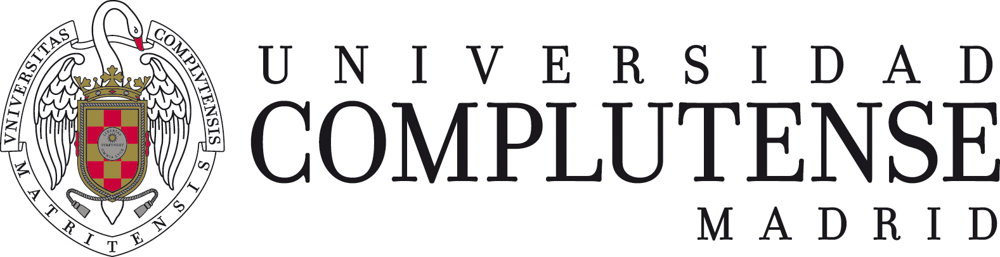

<link rel="stylesheet" href="style.css">



```{r setup, include=FALSE}
rm(list=ls())
knitr::opts_chunk$set(echo = FALSE)
library(knitr)
```

<br>

En éste documento se pueden visualizar algunos de los proyectos que he realizado durante mis estudios o por mi cuenta para ampliar mis habilidades. No se incluyen proyectos de mi vida profesional por cuestiones de confidencialidad.

Para cada uno de los proyectos hay un enlace para visualizar el informe completo. Para algunos, hay también un enlace para ver el código que genera el informe (archivos .Rmd). En otros informes, el código se muestra en el propio documento.

## Trabajo de fin de grado: Minería de textos

Realicé mi TFG sobre el **análisis bibliométrico en psicología**, obteniendo en el mismo la máxima calificación. El objetivo del proyecto era estudiar la evolución de la investigación en psicología a partir de los datos disponibles de forma libre en [Scopus](https://www.scopus.com/), una base de datos de artículos científicos.

Para ello, en primer lugar tenía que descargar los artículos de la base de datos, lo que implicaba interactuar con la API. Ésta tarea la desarrollé en **python**, ya que ofrece más facilidades para capturar excepciones y errores. Además, python tiene mejor soporte para trabajar con ficheros json ya que uno de sus tipos nativos (el diccionario) se ajusta muy bien a ésta estructura de datos.

Los datos se almacenaban en una base de datos de **SQLite**, que resultó ser perfecta para el proyecto. A pesar de que la base de datos contiene más de **150.000** artículos el rendimiento es excelente.

El análisis de los datos lo realicé con **R**, presentando los resultados en un informe de R markdown. Realicé un análisis descriptivo muy completo mediante gráficos interactivos, además probé varias técnicas de clusterización para ver si se podían realizar clasificaciones de los artículos de forma automática. También, desarrollé un método que a partir de unas métricas de similaridad permite crear redes temáticas.

[Informe completo](projects/TFG_MineriaTextoCompleto.html)

## Informe de ventas Target

Para practicar algo de css y html, utilicé unos datos ficticios para crear un informe de Ventas con estética de la marca Target. Todos los elementos del informe utilizan los colores de la marca, incluidos los gráficos. Los gráficos utilizan un tema personalizado, por lo que no es necesario definir la estética para cada gráfico.

En el informe encontramos algunos gráficos de barras de **ggplot** que muestran los datos en porcentaje. En los dos últimos gráficos hay muchas categorías representadas, de modo que para mejorar la legibilidad las barras se presentan de forma horizontal y se ordenan de menor a mayor.

[Informe](projects/VentasTarget.html)

[Código](https://github.com/manu-torres/portfolio/blob/main/projects/VentasTarget.Rmd)

<br>

<br>
