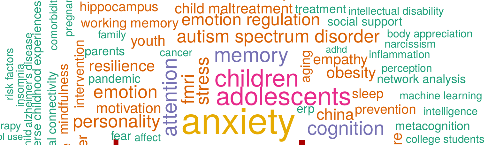
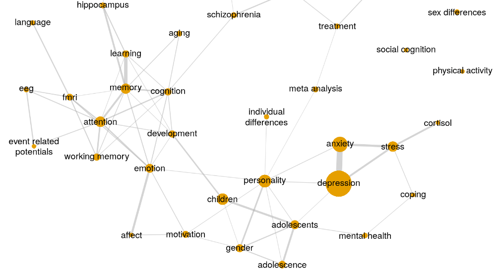
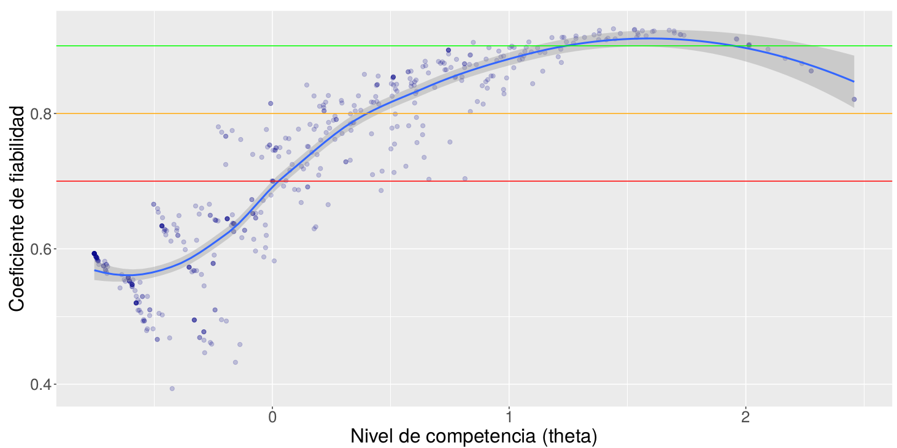
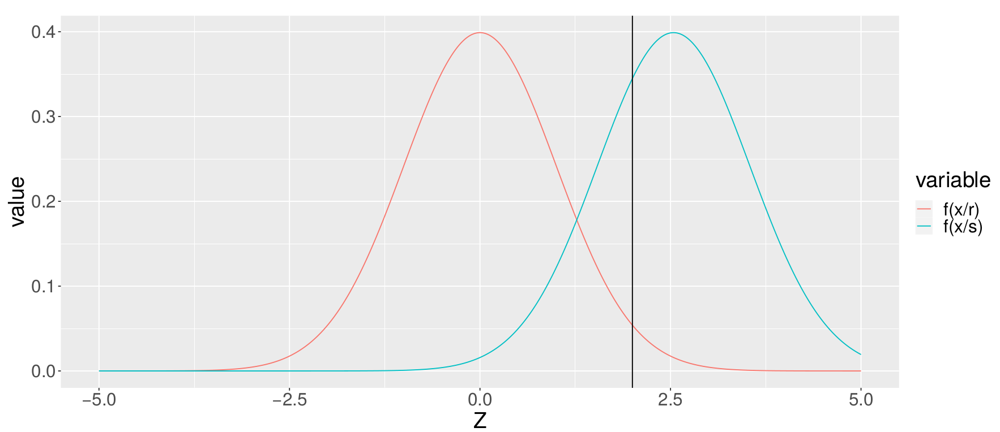
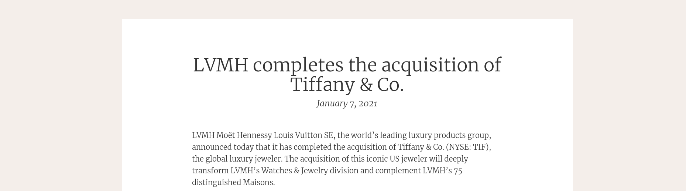

<link rel="stylesheet" href="style.css">

```{r setup, include=FALSE}
rm(list=ls())
knitr::opts_chunk$set(echo = FALSE)
library(knitr)
```

<br>

En éste documento se pueden visualizar algunos de los proyectos que he realizado durante mis estudios o por mi cuenta para ampliar mis habilidades. No se incluyen proyectos de mi vida profesional por cuestiones de confidencialidad.

<p class="annot">Se recomienda abrir los informes en una pestaña nueva</p>

## Proyectos académicos

### Trabajo de fin de grado: Minería de textos



Realicé mi TFG sobre el **análisis bibliométrico en psicología**, obteniendo en el mismo la máxima calificación. El objetivo del proyecto era estudiar la evolución de la investigación en psicología a partir de los datos disponibles de forma libre en [Scopus](https://www.scopus.com/), una base de datos de artículos científicos.

Para ello, en primer lugar tenía que descargar los artículos de la base de datos, lo que implicaba interactuar con la API. Ésta tarea la desarrollé en **python**, ya que ofrece más facilidades para capturar excepciones y errores. Además, python tiene mejor soporte para trabajar con ficheros json ya que uno de sus tipos nativos (el diccionario) se ajusta muy bien a ésta estructura de datos.

Los datos se almacenaban en una base de datos de **SQLite**, que resultó ser perfecta para el proyecto.

El análisis de los datos lo realicé con **R**, presentando los resultados en un informe de R markdown. Realicé un análisis descriptivo muy completo mediante **gráficos interactivos**, además probé varias técnicas de clusterización para ver si se podían realizar clasificaciones de los artículos de forma automática. También, desarrollé un método que a partir de unas métricas de similaridad permite crear redes temáticas.



[Informe completo](projects/TFG_MineriaTextoCompleto.html), click  [aquí](projects/TFG_MineriaTextoCompleto.html#Resultados) para ir directamente a los resultados, en donde se pueden ver los gráficos.

### Práctica Escalamiento Multidimensional

Práctica sobre una técnica de reducción de dimensiones.

[Informe en PDF](projects/EscalamientoMultidimensional.pdf)

### Práctica TCT

Una práctica del máster sobre la Teoría Clásica de los Tests.

[Informe en PDF](projects/TCT.pdf)

### Prácticas TRI

Dos prácticas relacionadas con la Teoría de Respuesta al Ítem.

[Ítems dicotómicos (PDF)](projects/TRI_DICO.pdf). En éste informe se aplica un modelo para ítems con dos opciones de respuesta (acierto/fallo). Ajustamos los modelos de 1, 2 y 3 parámetros, evaluando el ajuste relativo y absoluto de cada modelo. Comparamos las mediciones de la TRI con las de la TCT y comprobamos si efectivamente conseguimos la invarianza de medida.



[Ítems politómicos (PDF)](projects/TRI_POLI.pdf). En éste informe se aplica un modelo para ítems con varias opciones de respuesta (una escala graduada).

### Simulación Análisis Factorial Exploratorio

En ésta práctica teníamos que estudiar el comportamiento del análisis factorial exploratorio realizando algunas simulaciones de temática libre. Yo escogí estudiar el efecto del tamaño muestral y el valor de los pesos factoriales simulados sobre la calidad de la recuperación de los pesos y los valores del MSA (de la técnica KMO).

[Informe en PDF](projects/SimulacionFactorialExploratorio.pdf)

### Práctica TDS

Una práctica sobre la detección de señales mediante la cual estudiamos el patrón de respuesta de varios observadores. También he desarrollado una [implementación en python](https://github.com/manu-torres/portfolio/blob/main/projects/tdsPlot.py), que utilizo para visualizar el rendimiento de algunos modelos de clasificación.

[Informe en PDF](projects/TDS.pdf)



## Proyectos personales

### Informe de ventas Target

Utilicé unos datos ficticios para crear un informe de Ventas con estética de la marca Target. Todos los elementos del informe utilizan los colores de la marca, incluidos los gráficos de **ggplot**.

[Informe](projects/VentasTarget.html), [Código](https://github.com/manu-torres/portfolio/blob/main/projects/VentasTarget.Rmd)

### Comunicado para accionistas LVMH



En la página del grupo Louis Vuitton encontré un comunicado para accionistas, y me gustó la estética de la página. Por tanto, intenté replicar la estética del documento utilizando **HTML** y **CSS**.

[Informe](projects/ComunicadoLVMH.html), [Código](https://github.com/manu-torres/portfolio/blob/main/projects/ComunicadoLVMH.Rmd)

### Bolsa

He construido un sistema que va descargando automáticamente los precios y datos financieros de **más de 500 empresas** e incorpora toda ésta información en una base de datos de **SQLite**. Una vez que los datos están descargados, utilizo **R** y **python** para realizar toda clase de análisis y simulaciones sobre los mismos.

A continuación podemos ver algunos de los proyectos relacionados con éste tema.

#### Generación de cuadros de mando

He desarrollado un script al que se le pasa el código de una empresa (*ticker*), y genera un cuadro de mando con **flexdashboard** con mucha información sobre la misma: gráficos que representan el precio junto a las bandas de bollinger (y con los puntos coloreados por el RSI), información sobre el pago de dividendos...

[Dashboard](projects/DashboardAccion.html), [Código](https://github.com/manu-torres/portfolio/blob/main/projects/DashboardAccion.Rmd)

<br>

<br>
